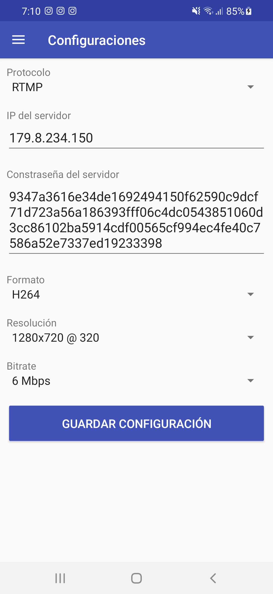

## Motivation

Este proyecto forma parte de un proyecto en colaboración con Ingeniería Mecánica de la Universidad de La Serena y LIITEC de ayuda comunitaria con el objetivo de mejorar la calidad de vida a un joven con dificultades motrices
El proyecto consta de dos partes. La parte del chasis donde lo que se busca es fabricar una especie de silla correctora de postura para que así nuestro cliente no se vea afectado con el mal posicionamiento al momento de sentarse en la silla, esto porque nuestro cliente actualmente cuenta con una postura encorvada lo que hacer que no sea óptima para el.

La segunda parte busca que el individuo tenga accesibilidad al mundo digital como normalmente la tiene, por lo que se realizó esta implementación de Screen Mirroring que lo que busca es transmitir la imagen de su celular a una pantalla secundaria que estará ubicada a una altura que coincida con la de su cabeza. Esto se realiza por el hecho de que nuestro cliente no puede realizar movimientos pronunciados de su brazo por lo que el celular principal sería una especie de control y todas las acciones se mostrarían por la pantalla secundaria. Además al realizarse la transmisión de pantalla a una página web facilita al supervisor del cliente su trabajo ya que simplemente con el enlace de la transmisión se podría acceder a la transmisión y así monitorear tanto actividades recreativas como actividades educativas.

## Capturas de la aplicación 

